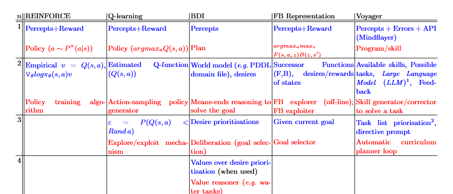

   

# Abstract

> Within the field of Autonomous Agents, the predominant paradigm is that agents perceive, reflect, reason, and act on an environment, employing some specific decision mechanism to pick actions. 
Nonetheless, the process that originates the decisions may differ depending on the agent, as this paradigm is agnostic about its concrete action selection inference.
However, the need for being able to explain these decisions is constantly increasing, and the heterogeneity of the internal processes of agents has ended up in different ad hoc techniques for each architecture, for providing explanations with disparate validation mechanisms, hindering efforts at comparing mechanisms.
>
> To tackle this, in this contribution, we propose a unifying architecture framework based on causality, beliefs, and intentions. This framework allows for the examination of heterogeneous agents (from BDI and RL to LLM-based agents) without modification. 
This approach clearly decouples declarative and procedural knowledge, as well as designer-given versus learnt representations. 
It categorises what kind of questions can be answered by each agent reasoning component and allows a more seamless workflow for transferring knowledge between diverse agent architectures.

# Core intuition

When considering explainability for agent behaviour, we often model it as the explanations of single actions. 
Unsurprisingly, given that there is a notion of 'state' of perceptions that influences such action-taking, an amount
of methods focus on summarising or explaining the _causality_ of an action as a function of the state.

However, much like human actions are not just a function of perception alone, but: neurons, hormones, experiences, and 
even natural selection; agent's actions are causally determined not just by the state, but their policy, the mechanisms
that brought it up, etc. A plethora of Explainable AI (_XAI_) methods already tackle this, each working to solve the causes behind
the mechanism of action-taking, generally for an architecture or a family of them.


## But, can't we have a more general XAI understanding of the causes behind the causes?
This idea of finding a general causal trace behind action-taking is not new either. This would enable _centralising_ the
problem of _XAI_: which kind of questions can be asked to an agent would become independent of the architecture,
user-studies would be exportable to new methods, and for a new architecture

There are taxonomies that seek to bridge the gap between existing architectures. However, when new architectures pop up,
how do we cast them together? Is it all work that needs to be re-done? How do we ensure that the standardised _XAI_ 
questions reply in the same terms, and are comparable with the new architecture's substrate?

In this webpage, the focus is to illustrate the logic and potential of this meta-architecture: the ladder of intentions.
In an effort to make it more understandable, there is less focus on rigour and more on the intuitions and underpinning
factors that could not make it into the paper itself, and refer to the paper for formal explanations as well as more
in-depth examples of particular scenarios.

### Reification as the underpinning idea

Think of an agent that receives some percepts _p1...pk_ about the world. These percepts are _eventually_ used to decide
which action to take. The action depends causally on the percepts (except in blind agents or edge-cases), but what about
the other side?

If a designer provides a perfectly imperative code that uses the percepts to determine the action,
then the cause of the action are the percepts _and_ this imperative code, and if we were to search for a cause for the
imperative code, it would be: someone programmed it that way.

If actions are taken according to a more declarative program (e.g., a planner), we could consider that actions are
determined by the percepts _and_ a plan; and in turn the plan was created by a planner _and_ some domain information: 
consequences of actions, etc.

If, however, actions are taken according to an opaque, learnt model (e.g. reinforcement learning), then the action
is determined by the percepts _and_ a learnt policy; and in turn the plan is created by a learning algorithm _and_
experience of the world, etc.

**The key insight** to building the Ladder model is that both of these latter two examples seem rather similar in what they
utilise to determine 'that which determines actions': knowledge of the world and how actions affect it. Even though the 
source, type, and informativeness of a domain description from a planner versus of some cumulative rewards linked to
actions taken in states, both of these share one thing. **They are statements or pieces of information that refer to
percepts and actions.** 

For example, a (simplified) domain description could include a statement like: 
```
Consequence of action [go_up]  :  percept[(at ?x ?y)] becomes percept[(at ?x ?y+1)]
```

Meanwhile, in a Q-learning scenario, we would find a statement such as:
```
The value of doing action [go_up] when percept[(at 3 24)] is 0.7
```

This is the rule we use to split the causal trace of action-taking homogeneously between architectures: percepts belong
in the first rung of the ladder, and any statement reifying or including a statement of level _i_ belongs at least to
level _i+1_. Each of these levels are named S_i. We associate each level with the imperative code that uses it: Ii(Si).
The final imperative code is action execution. Each imperative code is 'generated' or at least 'modified' by other
imperative codes, for example: 

> [actions] I0 =  [policy]I1([percepts]S1)
> 
> [policy]I1   = I2(S2)

## The Ladder

The Ladder architecture consists thus on a cascade of imperative code, starting from a fixed, designer-given code (IN)
and that culminates on action. Furthermore, this cascade is regulated or mediated by some statements. Eventually,
the statements (that are provided by the world or environment) determine the action, which affects the world in the next
state.

<div class="grid">
    <div class="col-1 screenshot">
        <div class="screenshot">
            
        </div>
    </div>
    <div class="col-2">
        <p class="results-text">
            The separation between statements and imperative code is no coincidence: there are many benefits for
            separating declarative and procedural knowledge, key among those transferability.

            Moreso, from an XAI perspective, one can consider the branches of causality similar to that of intention:
            if intention is a desire to do something together with the belief that it is achievable, here S takes the 
            role of belief, and intentions take the role of 'desires' of a higher order of abstraction.
        </p>
    </div>
</div>


Following this logic, we can take a variety of architectures and cast them into the framework, from Q-learning and
REINFORCE (traditional RL techniques), purely symbolic BDI agents, LLM-based Voyager, or even approximations from zero-shot
RL like Touati's Forward-Backward representation (from his paper 'Does Zero-Shot RL exist?').



In the table, we list each of the levels with statements (in blue) and the algorithm or intention (in red). Note how
each algorithm determines the algorithm of the next level, such as priming a means-ends reasoner or planner with a goal,
modifying the policy weights, or coding the program that will run the agent in the environment.

We note that statements in each level are generally homogeneous across architectures by design. The first level is
about perceptions and alternative environment feedback (be it rewards, error messages, action spaces...). The second
level speaks of action consequence: in terms of value, changes in the world, how reachable a state may be, or even in 
terms of how a code should change to fix an error (related to a percept in the environment) in the case of Voyager.
Higher levels are less common, but are often related to 'strategies' to achieve or balance goals to fulfill an endgoal:
exploration as a means to improve exploitation, and how much the trade-off should go to achieve it; priorisation between
goals given a context, etc.

Key among these observations is how the environment changes when learning happens.

### Learning in the Ladder

Statements and intentions are generally non-static. The previous image displays the ladder as a fixed causal graph, in
a single time-step and involving a single action.

When does intention change? Much like actions (considered the lowest level intention), each intention is conditioned by
the intention and the statements of the next level (its desire and beliefs, respectively). Given the recursivity of 
changes in intention, we can say intentions change when beliefs change.

A belief can change as a result of a direct change of percepts (a change in S1 effecting a change in higher levels) or,
most interestingly, when we are _learning_. We say more interestingly given that, in models where this is not the case,
the separation in levels may result not only arbitrary, but useless: why stratify things of upper levels if they all
determine something fixed across the entire lifespan of the agent? If a policy is constant, it makes little sense to
distinguish those levels.

In the model of the ladder, it seems apparent that learning or altering a 
statement of a particular level ---which contains statements and intentions of a lower level--- should be a result of 
_experiencing_ a number of statements and intentions of such level. In retrospect, it is obvious: learning the 
consequences of actions requires to see sequences of states and actions.

In this model, we introduce this form of causality in an informal way: the set of variables S and I of the inferior
rung of the ladder are 'compiled' into a statement of the current level by an algorithm (which we named E from Epistemic).
This implies that _E_ is whatever algorithms were used to create the Q-function from rewards, process and write the 
feedback for Voyager, etc. Similarly, it would be the curriculum or 'updater' of the epsilon parameter in Q-learning.
All of these are statements that 'make sense' to be updated from inferior levels (Q-learning being updated with reward
and experience from state-action trajectories, feedback being compiled by locating the unexpectedness of states and the
error logs, or decaying epsilon given that the Q-function appears to be converging to a useful exploiter).


As such, rather than giving a cross-section of the model, it makes sense to see it working through time: statements and
intentions can hold at a certain moment, but they can also cease or start. When analysing action explainability, the
causal chain needs to consider all intentions that hold at the moment of taking an action, as well as all statements.

This is a particularly beneficial property of the architecture, reducing the workload of producing a single explanation:
while intentions and statements may be long-lived, it is possible to trace when did they start, and which were the causes
of their existence.


However, while it is important to understand the source of intentions, and desires; it
is also important to explain the source of beliefs. Understanding of 'why the agent believes the things it does' and
what are the sources or mechanisms for beliefs and how an epistemic engine compiles them is an important explainability
task.

As such, we conclude that there are three types of explainability questions per level, each replying in a vocabulary of
other elements of the model:
*  What was the intent behind I_i? $$I_{i+1}$$ is its desire. This question can be trivial if there is just one clear
intention, but if it is a composite it can be tricky to find which particular sub-desire is the responsible behind the
intent.
* What were the beliefs that made you think I_i helped you achieve $$I_{i+1}$$? The answer should be a subset of relevant
statements from $$S_{i+1}$$.
* What were the reasons why you believed in a statement $$s\in S_{i}? The answer should refer to a set or sequence of
$$S_{i-1}$$ and $$I_{i-1}$$, potentially with some further references to the mechanism of E.

[//]: # (## Current status)

[//]: # (IPG)

# Cite as

```
@inproceedings{gimenez_ladder_2025,
author = {Gimenez-Abalos, Victor and Tormos, Adrian and Edström, Filip and Alvarez-Napagao, Sergio and Vázquez-Salceda, Javier and Brännström, Mattias and Lindqvist, John},
title = {Ladder of Intentions: unifying agent architectures for explainability and transferability},
year = {2025},
TODO: EXTRAAMAS block
}
```